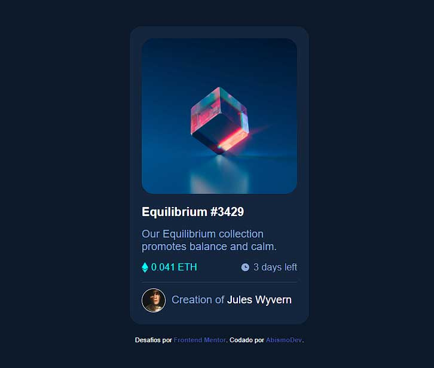

# Frontend Mentor - NFT preview card component solution

This is a solution to the [NFT preview card component challenge on Frontend Mentor](https://www.frontendmentor.io/challenges/nft-preview-card-component-SbdUL_w0U). Frontend Mentor challenges help you improve your coding skills by building realistic projects. 

## Table of contents

- [Overview](#overview)
  - [The challenge](#the-challenge)
  - [Screenshot](#screenshot)
  - [Links](#links)
- [My process](#my-process)
  - [Built with](#built-with)
- [Author](#author)

## Overview

### The challenge

Users should be able to:

- View the optimal layout depending on their device's screen size
- See hover states for interactive elements

### Screenshot

### Links

- Solution URL: [My solution](https://www.frontendmentor.io/solutions/nft-card-component-responsive-5O5AgHG59b)
- Live Site URL: [Live site](https://nft-card-component-blond-six.vercel.app/)

## My process

### Built with

- Semantic HTML5 markup
- Styled with CSS3
- Flexbox
- Responsive

## Author

- Website - In construction
- Frontend Mentor - [@AbismoDev](https://www.frontendmentor.io/profile/AbismoDev)
- Instagram - [@Welli.18](https://www.instagram.com/welli.18)
